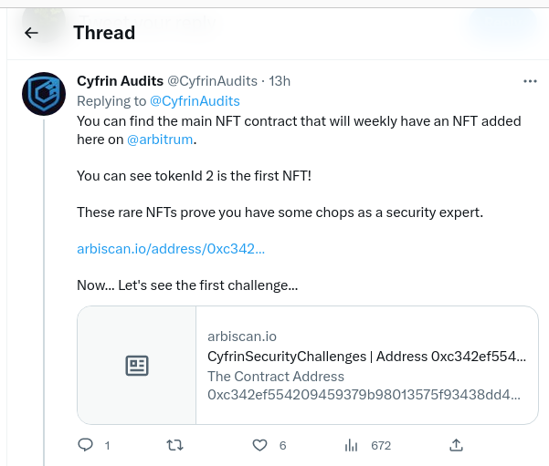
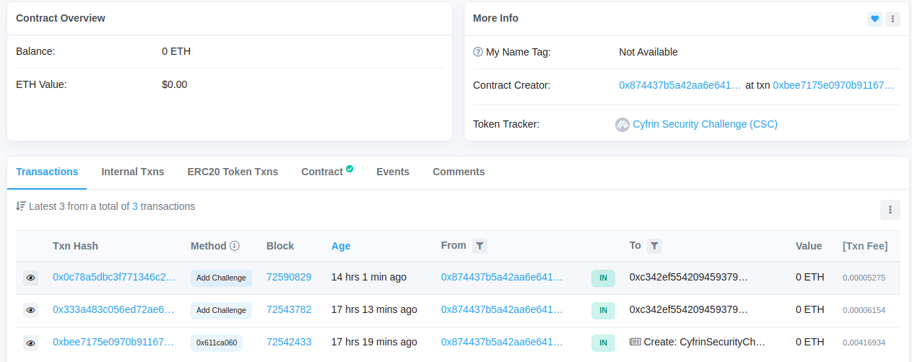
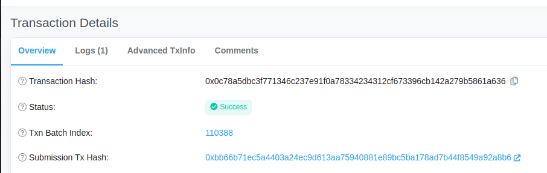
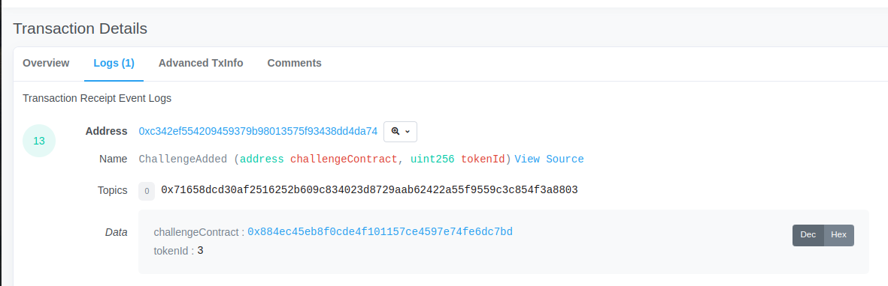
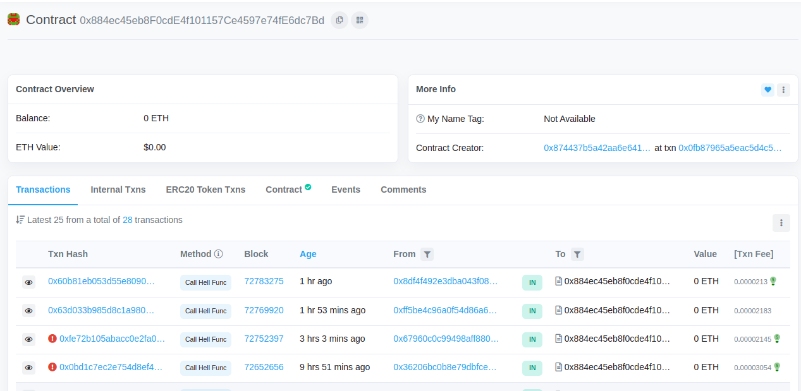
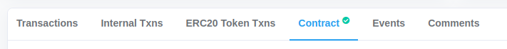
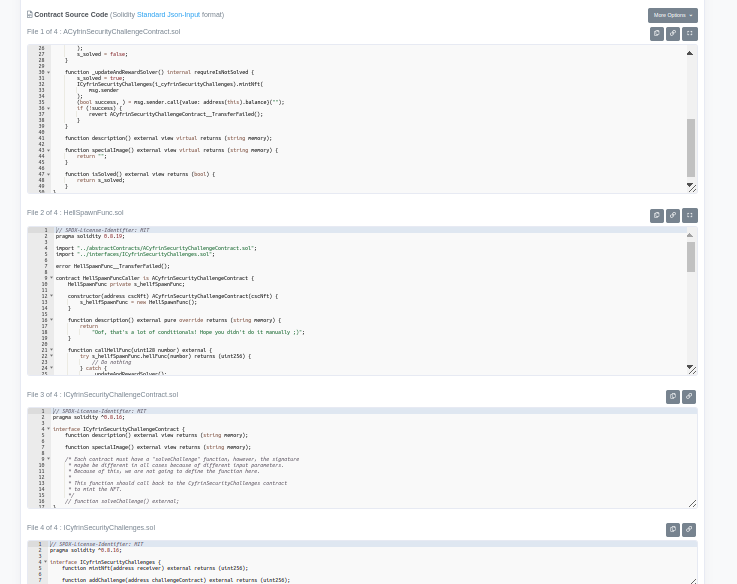
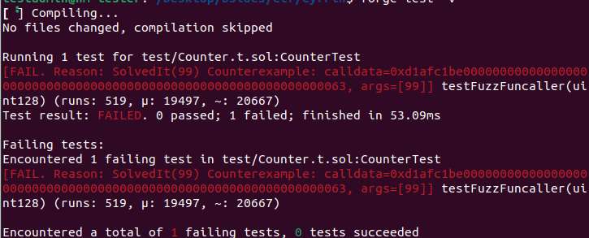

# The Cyfrin NFT First CTF Walkthrough
Author: [parsely](https://twitter.com/_Parsely_)<br>
## Exploring the blockchain, FUZZING with Foundry, let's learn together!
## This walkthrough will show the steps I took to solve the challenge and how you can solve it locally using foundry without needing to test on-chain or fork a network.
## Prerequisites:
This walkthrough assumes you have foundry installed already<br>
[https://book.getfoundry.sh/getting-started/installation](https://book.getfoundry.sh/getting-started/installation)
## The Start
The initial tweet from Cyfrin Audits [https://www.cyfrin.io/](https://www.cyfrin.io/) contains a link to a contract that has been deployed on the Arbitrum network.<br><br>
[https://arbiscan.io/address/0xc342ef554209459379b98013575f93438dd4da74](https://arbiscan.io/address/0xc342ef554209459379b98013575f93438dd4da74)<br>
<br><br>
Clicking on the link takes us to an explorer page that shows the contract and we can see that 3 transactions are listed.<br><br>
<br><br>
<br>
The link of the top transaction should take us a little closer to solving this challenge, because the ```Add Challenge``` call was made. <br>This looks interesting!<br><br><br>
<br><br>
This takes us to the details of the transaction, **BUT** let's take a closer look at the **Logs** tab.<br>

<br><br>
The logs reveal the exact call made and the data sent. **BINGO!!!**<br> We have the contract address where the actual challenge is. Once again let's follow the link
<br><br>
**follow the link** <br><br>
On the explorer page we get more details of the contract, but this time it's for the contract we need in order to solve the CTF.<br>
The **Contract** tab seems to have a verified tick next to it, the code must be visible to us, click the **Contract** tab.<br><br>
<br><br>
**We can now investigate the code for the challenge!!**<br><br>
<br><br>
All the relevant code is available to us now.<br><br>
<br><br>

The code we need is in the **2nd** code block in the list.<br><br>
The first thing we need to do is set up a foundry test project
1. Create a directory eg. ```mkdir nftctf```.
2. cd into the directory ```cd nftctf```.
3. Inititalize a foundry project in the empty directory.
4. ```forge init --no-git```
5. **--no-git** is only if you don't want to interact with git.
6. Delete the Counter.sol in the ```src``` directory.
7. Delete the Counter.t.sol in the ```test``` directory.
8. Create a new file in the ```src``` directory, let's call it ```Challenge.sol```.
9. Create a new file in the ```test``` directory, let's call it ```challenge.t.sol```.

Now we need to paste the challenge code into ```Challenge.sol``` and make a few alterations to be able to run locally.<br>
You will notice I changed the naming convention slightly but the concept remains the same.<br><br>
Now that we no longer run on-chain, we no longer need to import the other contracts. So I removed the code below:
```
import "../abstractContracts/ACyfrinSecurityChallengeContract.sol";
import "../interfaces/ICyfrinSecurityChallenges.sol";
```
<br>
We can no longer inherit contracts due to the imports being removed. So our contract needs to be amended to remove the inheritance statement:

```
is ACyfrinSecurityChallengeContract {
```

In the constructor I removed the code:

```
constructor(address cscNft) ACyfrinSecurityChallengeContract(cscNft) {
```

thus the constructor code becomes:

```
constructor() {
```
## The solution
To solve the CTF we need to call the function below and trigger an error in the function, as only then the code in the function ```_updateAndRewardSolver();``` will run. This is because it's in a ```try/catch``` block.<br><br>

```
	try s_hfSpawnFunc.hFunc(numbor) returns (uint256) {
            // Do nothing
        } catch {
            _updateAndRewardSolver();
        }
```
because we are not on-chain, I added an error, so that we can trigger it and see when we have solved the CTF:
```
error YouSolvedIt(unit128 badNumber);
```
We need to remove the ```_updateAndRewardSolver();``` and replace it with ```YouSolvedIt(numbor);```
<br>
```
try s_hfSpawnFunc.hFunc(numbor) returns (uint256) {
            // Do nothing
        } catch {
            YouSolvedIt(numbor);
        }
```

## The code we can run locally now looks like this:
```
// SPDX-License-Identifier: MIT
pragma solidity 0.8.19;


error hSpawnFunc__TransferFailed();
error YouSolvedIt(unit128 badNumber);

contract hSpawnFuncCaller{
    hSpawnFunc private s_hfSpawnFunc;

    constructor() {
        s_hfSpawnFunc = new hSpawnFunc();
    }

    function description() external pure override returns (string memory) {
        return
            "Oof, that's a lot of conditionals! Hope you didn't do it manually ;)";
    }

    function callhFunc(uint128 numbor) external {
        try s_hfSpawnFunc.hFunc(numbor) returns (uint256) {
            // Do nothing
        } catch {
            YouSolvedIt(numbor);
        }
    }

    function gethSpawnFuncAddress() external view returns (address) {
        return address(s_hfSpawnFunc);
    }
}

type Int is uint256;
using {add as -} for Int global;
using {div as +} for Int global;
using {mul as /} for Int global;
using {sub as *} for Int global;

function add(Int a, Int b)  pure returns(Int){
    return Int.wrap(Int.unwrap(a) / Int.unwrap(b));
}

function div(Int a, Int b)  pure returns(Int){
    return Int.wrap(Int.unwrap(a) * Int.unwrap(b));
}

function mul(Int a, Int b)  pure returns(Int){
    return Int.wrap(Int.unwrap(a) - Int.unwrap(b));
}

function sub(Int a, Int b) pure returns(Int){
    return Int.wrap(Int.unwrap(a) + Int.unwrap(b));
}

contract hSpawnFunc {
    uint256 numbr = 10;
    uint256 namber = 3;
    uint256 nunber = 5;
    uint256 mumber = 7;
    uint256 numbor = 2;
    uint256 numbir = 10;

    address owner;

    constructor(){
        owner = msg.sender;

    }

    modifier onlyOwner() {
        require(msg.sender == owner, "Only owner can call this function.");
        _;
    }

    function hFunc(uint128 numberr) public view onlyOwner returns (uint256) {
        uint256 numberrr = uint256(numberr);
        Int number = Int.wrap(numberrr);
        if (Int.unwrap(number) == 1) {
            if (numbr < 3) {
                return Int.unwrap((Int.wrap(2) - number) * Int.wrap(100) / (number + Int.wrap(2)));
            }
            if (Int.unwrap(number) < 3) {
                return Int.unwrap((Int.wrap(numbr) - number) * Int.wrap(92) / (number + Int.wrap(3)));
            }
            if (Int.unwrap(Int.wrap(Int.unwrap(Int.wrap(Int.unwrap(Int.wrap(1)) / Int.unwrap(Int.wrap(Int.unwrap(Int.wrap(Int.unwrap(Int.wrap(numbr)))))))))) == 9) {
                return 1654;
            }
            return 5 - Int.unwrap(number);
        }
        if (Int.unwrap(number) > 100) {
            _numbaar(Int.unwrap(number));
            uint256 dog = _numbaar(Int.unwrap(number) + 50);
            return (dog + numbr - (numbr / numbir) * numbor) - numbir;
        }
        if (Int.unwrap(number) > 1) {
            if (Int.unwrap(number) < 3) {
                return Int.unwrap((Int.wrap(2) - number) * Int.wrap(100) / (number + Int.wrap(2)));
            }
            if (numbr < 3) {
                return (2 / Int.unwrap(number)) + 100 - (Int.unwrap(number) * 2);
            }
            if (Int.unwrap(number) < 12) {
                if (Int.unwrap(number) > 6) {
                    return Int.unwrap((Int.wrap(2) - number) * Int.wrap(100) / (number + Int.wrap(2)));
                }
            }
            if (Int.unwrap(number) < 154) {
                if (Int.unwrap(number) > 100) {
                    if (Int.unwrap(number) < 120) {
                        return (76 / Int.unwrap(number)) + 100 - Int.unwrap(Int.wrap(uint256(uint256(uint256(uint256(uint256(uint256(uint256(uint256(uint256(uint256(uint256(uint256(numbr))))))))))))) + Int.wrap(uint256(2)));
                    }
                }
                if (Int.unwrap(number) > 95) {
                    return Int.unwrap(Int.wrap((Int.unwrap(number) % 99)) / Int.wrap(1));
                }
                if (Int.unwrap(number) > 88) {
                    return Int.unwrap((Int.wrap((Int.unwrap(number) % 99) + 3)) / Int.wrap(1));
                }
                if (Int.unwrap(number) > 80) {
                    return (Int.unwrap(number) + 19) - (numbr * 10);
                }
                return Int.unwrap(number) + numbr - Int.unwrap(Int.wrap(nunber) / Int.wrap(1));
            }
            if (Int.unwrap(number) < 7654) {
                if (Int.unwrap(number) > 100000) {
                    if (Int.unwrap(number) < 1200000) {
                        return (2 / Int.unwrap(number)) + 100 - (Int.unwrap(number) * 2);
                    }
                }
                if (Int.unwrap(number) > 200) {
                    if (Int.unwrap(number) < 300) {
                        return (2 / Int.unwrap(number)) + Int.unwrap(Int.wrap(100) / (number + Int.wrap(2)));
                    }
                }
            }
        }
        if (Int.unwrap(number) == 0) {
            if (Int.unwrap(number) < 3) {
                return Int.unwrap((Int.wrap(2) - (number * Int.wrap(2))) * Int.wrap(100) / (Int.wrap(Int.unwrap(number)) + Int.wrap(2)));
            }
            if (numbr < 3) {
                return (Int.unwrap(Int.wrap(2) - (number * Int.wrap(3)))) + 100 - (Int.unwrap(number) * 2);
            }
            if (numbr == 10) {
                return Int.unwrap(Int.wrap(10));
            }
            return (236 * 24) / Int.unwrap(Int.wrap(Int.unwrap(Int.wrap(Int.unwrap(Int.wrap(Int.unwrap(number)))))));
        }
        return numbr + nunber - mumber - mumber;
    }

    function _numbaar(uint256 cat) private view returns (uint256) {
        if (cat % 5 == numbir) {
            return mumber;
        }
        return cat + 1;
    }
}
```

## Foundry
In the ```test``` directory, we have created a file called ```Challenge.t.sol```.<br>
Most foundry test classes look very similar so we can paste this template code into it.<br>
```
// SPDX-License-Identifier: UNLICENSED
pragma solidity ^0.8.13;

import "forge-std/Test.sol";

contract ChallengeTest is Test {
    function setUp() public {
    }
}
```
All that is needed now is to add a function to run the fuzzing.<br>
Fuzzing is explained in the Foundry book at [https://book.getfoundry.sh/reference/config/testing#fuzz](https://book.getfoundry.sh/reference/config/testing#fuzz)
<br><br>
Fuzzing allows the framework to call a function multiple times with various different inputs, based on the data type.<br>
We need to call the function:
```
function callhFunc(uint128 numbor) external {
        try s_hfSpawnFunc.hFunc(numbor) returns (uint256) {
            // Do nothing
        } catch {
            YouSolvedIt(numbor);
        }
    }
```
And thus we can use a data type of ```uint128``` which is the same as the input for the function we need to call.<br>
According to the documentation a fuzzing function needs to include the signature ```testFuzz``` so we need to amend our test class to add such a function. we would then need to import the local file ```Challenge.sol``` from ```src``` in order to call the CTF contract.
<br><br>
```
// SPDX-License-Identifier: UNLICENSED
pragma solidity ^0.8.13;

import "forge-std/Test.sol";
import "../src/Challenge.sol";

contract CounterTest is Test {
    HellSpawnFuncCaller public hs;

    function setUp() public {
        hs = new HellSpawnFuncCaller();
    }

    function testFuzzFuncaller(uint128 numm) public {
    	hs.callHellFunc(numm);
    }
}
```
**That's it**. 
That's all that is needed......**kinda**.
<br>
Just one more small tweak.<br>
By default the fuzzer only runs 256 times, so we need to make sure it can run a few more times.<br>
In the root directory of your project create an empy file called ```.env```.<br>
Paste the config below into the file, this will allow the fuzzer to run 10_000 times.<br>

```FOUNDRY_FUZZ_RUNS =10000```
<br>
Now we can run the forge test command, I like to add -vvvv to get a bit more detail in the output.<br>
```forge test -vvvv```
<br><br>
<br><br>
**Now we have the number that will trigger the failure and solve the CTF**
<br>
If you look at the transction that successfully solved the CTF on-chain, the input that was sent is: <br>
"0000000000000000000000000000000000000000000000000000000000000063" <br>
This equates to the same number we got above in the ```YouSolvedIt()``` error, but our number is in decimal format and the solution number is in hex.
<br>
## Thank you for reading this far!
# Thank you to Cyfrin for the learning opportunity.
